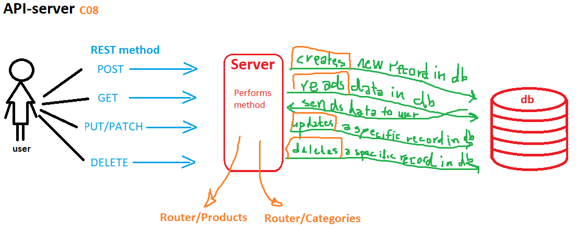

# LAB - Class 09

# Lab: API Server Phase 4

# Author: Darah

# Links and Resources

[submission PR](https://github.com/Darah98/api-server/pull/4)

[ci/cd](https://github.com/Darah98/api-server/runs/732327101?check_suite_focus=true)

[Swagger](https://app.swaggerhub.com/apis/Darah98/api-server/0.1#/default/post_categories)

## Setup

### How to initialize/run your application

- To run application: nodemon/ npm start index.js

### UML

