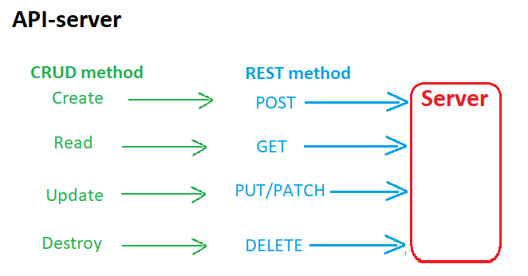

# LAB - Class 06

# Lab: HTTP and REST

# Author: Darah

# Links and Resources

[submission PR](https://github.com/Darah98/api-server/pull/1)

[ci/cd](https://github.com/Darah98/api-server/pull/1/checks?check_run_id=725278346)

[Swagger](https://app.swaggerhub.com/apis/Darah98/api-server/0.1#/default/post_categories)

## Setup

### How to initialize/run your application

- To run application: json-server --watch ./data/db.json

### UML

